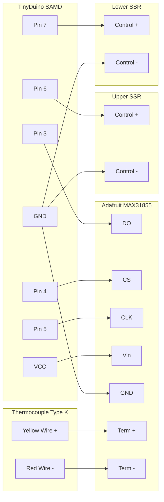

# Kiln Controller Wiring

Based on the pin definitions in `src/kiln.cpp`, here is the wiring guide for connecting the TinyDuino SAMD to the Adafruit MAX31855 thermocouple amplifier and the Solid State Relays (SSRs).

## Pin Connections

### MAX31855 Thermocouple Amplifier

| TinyDuino SAMD (Host) | Adafruit MAX31855 Breakout | Description |
| :--- | :--- | :--- |
| **GND** | **GND** | Ground |
| **VCC** (3.3V or 5V) | **Vin** | Power |
| **Pin 5** | **CLK** | SPI Clock |
| **Pin 4** | **CS** | Chip Select |
| **Pin 3** | **DO** | Data Out (MISO) |

### Thermocouple

| Thermocouple (Type K) | MAX31855 Terminal Block |
| :--- | :--- |
| **Yellow Wire (+)** | **+** |
| **Red Wire (-)** | **-** |

*(Note: If using IEC standard, Green is + and White is -)*

### Solid State Relays (SSRs)

| TinyDuino SAMD (Host) | SSR Terminal | Description |
| :--- | :--- | :--- |
| **Pin 6** | **Control + (Upper SSR)** | Upper Element Control |
| **Pin 7** | **Control + (Lower SSR)** | Lower Element Control |
| **GND** | **Control - (Both SSRs)** | Common Ground |

## Schematic Diagram (Mermaid Viewer)

